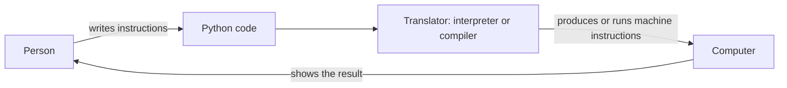

# What Is Programming?

Programming is the process of writing instructions that a computer can execute to perform a task or solve a problem. These instructions are written in a programming language such as Python.

## Key Ideas

- A **program** is a set of instructions.
- An **algorithm** is a sequence of steps for solving a problem.
- A **programming language** provides rules and words for expressing those steps.
- Computers follow instructions precisely, so the order and details matter.

## From Person to Computer



1. **Person:** decides what the program should do and writes instructions.
2. **Python code:** the instructions are written using Python's syntax and saved in a `.py` file.
3. **Translator:** software translates the Python instructions into steps the computer can execute. An interpreter runs a program through its runtime; a compiler translates code before it is run. Python implementations can combine these approaches. For example, CPython compiles source code to bytecode, then its Python virtual machine executes that bytecode.
4. **Computer:** the processor carries out the instructions, and the program can produce output for the person to see.

## Example

A simple algorithm for greeting someone is:

1. Ask for their name.
2. Store the answer.
3. Display a greeting using that name.

In Python, that might look like:

```python
name = input("What is your name? ")
print("Hello,", name)
```

## Remember

Programming is not only typing code. It also involves understanding a problem, planning steps, testing the result, and correcting mistakes (debugging).